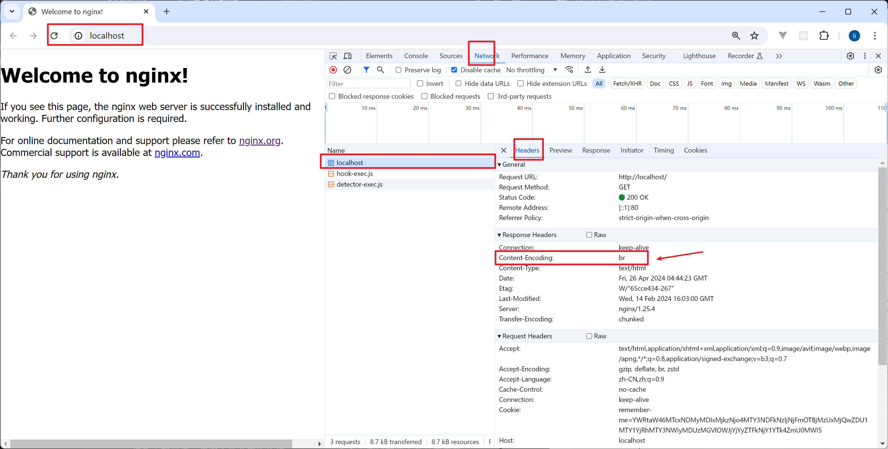

# lishaohai/nginx-brotli

https://hub.docker.com/r/lishaohai/nginx-brotli

## 运行镜像

```bash
docker run --name mynginx -d -p 8888:80 lishaohai/nginx-brotli:1.25.4
```

## 使用 curl 测试

使用 [curl windows](https://curl.se/windows/) 测试，如果 Content-Encoding 头包含 br，这表明响应确实使用了 Brotli 压缩。如果这个头不存在，或者它显示的是 gzip 或其他值，那么服务器可能不支持 Brotli 压缩，或者请求的资源没有被压缩。

发送带有 Brotli 压缩请求的命令:

```bash
curl -I -H "Accept-Encoding: br" http://localhost:8888
```

Windows 日志如下：

```powershell
PS C:\Users\Administrator\Desktop\nginx-course\curl-8.7.1_7-win64-mingw\bin> .\curl.exe --version
curl 8.7.1 (x86_64-w64-mingw32) libcurl/8.7.1 LibreSSL/3.9.1 zlib/1.3.1 brotli/1.1.0 zstd/1.5.6 WinIDN libpsl/0.21.5 libssh2/1.11.0 nghttp2/1.61.0 ngtcp2/1.4.0 nghttp3/1.2.0
Release-Date: 2024-03-27
Protocols: dict file ftp ftps gopher gophers http https imap imaps ipfs ipns ldap ldaps mqtt pop3 pop3s rtsp scp sftp smb smbs smtp smtps telnet tftp ws wss
Features: alt-svc AsynchDNS brotli HSTS HTTP2 HTTP3 HTTPS-proxy IDN IPv6 Kerberos Largefile libz NTLM PSL SPNEGO SSL SSPI threadsafe UnixSockets zstd
```

```powershell
PS C:\Users\Administrator\Desktop\nginx-course\curl-8.7.1_7-win64-mingw\bin>  .\curl.exe -I -H "Accept-Encoding: br" http://localhost:8888
HTTP/1.1 200 OK
Server: nginx/1.25.4
Date: Tue, 30 Apr 2024 16:31:55 GMT
Content-Type: text/html
Last-Modified: Wed, 14 Feb 2024 16:03:00 GMT
Connection: keep-alive
ETag: W/"65cce434-267"
Content-Encoding: br

PS C:\Users\Administrator\Desktop\nginx-course\curl-8.7.1_7-win64-mingw\bin>
```

## 开发日志

### 编写 Dockerfile 编译 brotli 模块

Dockerfile 文件内容如下，是根据 https://github.com/google/ngx_brotli 官方仓库进行编写

```dockerfile
# 使用 Nginx 官方镜像作为基础镜像
FROM nginx:1.25.4

# 安装必要的构建工具和库
RUN apt-get update && apt-get install -y \
    apt-transport-https \
    build-essential \
    libpcre3-dev \
    zlib1g-dev \
    libssl-dev \
    wget \
    git \
    cmake \
    autoconf \
    libtool

# 克隆 ngx_brotli 和 Brotli 源代码，编译 Brotli 库
RUN git clone --recurse-submodules -j8 https://github.com/google/ngx_brotli /usr/src/ngx_brotli \
    && cd /usr/src/ngx_brotli/deps/brotli \
    && mkdir out && cd out \
    && cmake -DCMAKE_BUILD_TYPE=Release -DBUILD_SHARED_LIBS=OFF \
       -DCMAKE_C_FLAGS="-Ofast -m64 -march=native -mtune=native -flto -funroll-loops -ffunction-sections -fdata-sections -Wl,--gc-sections" \
       -DCMAKE_CXX_FLAGS="-Ofast -m64 -march=native -mtune=native -flto -funroll-loops -ffunction-sections -fdata-sections -Wl,--gc-sections" \
       -DCMAKE_INSTALL_PREFIX=./installed .. \
    && cmake --build . --config Release --target brotlienc \
    && make install

# 下载并准备 Nginx 源码
RUN wget https://nginx.org/download/nginx-1.25.4.tar.gz -O /tmp/nginx.tar.gz \
    && tar -zxvf /tmp/nginx.tar.gz -C /usr/src/ \
    && mv /usr/src/nginx-1.25.4 /usr/src/nginx

# 编译 Nginx 与 Brotli 模块
RUN cd /usr/src/nginx \
    && ./configure --with-compat --add-dynamic-module=/usr/src/ngx_brotli \
    && make modules

# 将编译好的模块拷贝到适当位置
RUN cp /usr/src/nginx/objs/ngx_http_brotli_filter_module.so /usr/lib/nginx/modules/ \
    && cp /usr/src/nginx/objs/ngx_http_brotli_static_module.so /usr/lib/nginx/modules/

# 清理不必要的文件和库
RUN apt-get remove --purge -y build-essential wget git cmake autoconf libtool \
    && apt-get autoremove -y \
    && apt-get clean \
    && rm -rf /var/lib/apt/lists/* /usr/src/nginx /usr/src/ngx_brotli

# 在 Nginx 配置文件中加载 Brotli 模块
RUN mkdir -p /etc/nginx/modules-enabled \
    && echo 'load_module modules/ngx_http_brotli_filter_module.so;' > /etc/nginx/modules-enabled/50-mod-http-brotli-filter.conf \
    && echo 'load_module modules/ngx_http_brotli_static_module.so;' > /etc/nginx/modules-enabled/50-mod-http-brotli-static.conf
```

注意：

- 1. 这里的 `FROM nginx:1.25.4` 版本要和底部的 `https://nginx.org/download/nginx-1.25.4.tar.gz` 版本要一致
- 2. `apt-transport-https` 是解决 `apt-get update' returned a non-zero code: 100`的错误，参考地址 https://stackoverflow.com/questions/38002543/apt-get-update-returned-a-non-zero-code-100

### 构建自己编译的 brotli 镜像

```bash
docker build -t nginx-brotli .
```

### 运行 Docker 容器

```bash
docker run --name mybrotli -d -p 80:80 nginx-brotli
```

查看 mybrotli 容器状态

```bash
docker ps -a
```

访问 http://localhost:80

现在的 mybrotli 容器是没有配置 br 压缩的，因为需要 nginx.conf 中手动加载动态库和添加配置

### docker cp 拷贝容器内部的默认 nginx.conf

```bash
docker cp mybrotli:/etc/nginx/nginx.conf ./nginx.conf
```

### 修改 nginx.conf 和 Dockerfile 文件

1. 加载动态库 load_module，必须再 events 和 http 模块之前
   https://github.com/google/ngx_brotli?tab=readme-ov-file#dynamically-loaded

```conf
user nginx;
worker_processes auto;
# Load Brotli modules at the top of the file before other directives
load_module modules/ngx_http_brotli_filter_module.so;
load_module modules/ngx_http_brotli_static_module.so;
```

2. 启动 nginx brotli 配置 https://github.com/google/ngx_brotli?tab=readme-ov-file#sample-configuration

```conf
    brotli on;
    brotli_comp_level 6;
    brotli_static on;
    brotli_types application/atom+xml application/javascript application/json application/vnd.api+json application/rss+xml
                application/vnd.ms-fontobject application/x-font-opentype application/x-font-truetype
                application/x-font-ttf application/x-javascript application/xhtml+xml application/xml
                font/eot font/opentype font/otf font/truetype image/svg+xml image/vnd.microsoft.icon
                image/x-icon image/x-win-bitmap text/css text/javascript text/plain text/xml;
```

3. 完整的 nginx.conf

```conf
user nginx;
worker_processes auto;

# Load Brotli modules at the top of the file before other directives
load_module modules/ngx_http_brotli_filter_module.so;
load_module modules/ngx_http_brotli_static_module.so;

error_log /var/log/nginx/error.log notice;
pid /var/run/nginx.pid;

events {
    worker_connections 1024;
}

http {
    brotli on;
    brotli_comp_level 6;
    brotli_static on;
    brotli_types application/atom+xml application/javascript application/json application/vnd.api+json application/rss+xml
                application/vnd.ms-fontobject application/x-font-opentype application/x-font-truetype
                application/x-font-ttf application/x-javascript application/xhtml+xml application/xml
                font/eot font/opentype font/otf font/truetype image/svg+xml image/vnd.microsoft.icon
                image/x-icon image/x-win-bitmap text/css text/javascript text/plain text/xml;

    include /etc/nginx/mime.types;
    default_type application/octet-stream;

    log_format main '$remote_addr - $remote_user [$time_local] "$request" '
                    '$status $body_bytes_sent "$http_referer" '
                    '"$http_user_agent" "$http_x_forwarded_for"';

    access_log /var/log/nginx/access.log main;

    sendfile on;
    #tcp_nopush on;

    keepalive_timeout 65;

    #gzip on;

    include /etc/nginx/conf.d/*.conf;
}

```

4. 在 Dockerfile 末尾添加 `COPY ./nginx.conf /etc/nginx/nginx.conf` 命令把 nginx.conf 拷贝到容器中

```dockerfile

# 使用 Nginx 官方镜像作为基础镜像
FROM nginx:1.25.4

# 安装必要的构建工具和库
RUN apt-get update && apt-get install -y \
    apt-transport-https \
    build-essential \
    libpcre3-dev \
    zlib1g-dev \
    libssl-dev \
    wget \
    git \
    cmake \
    autoconf \
    libtool

# 克隆 ngx_brotli 和 Brotli 源代码，编译 Brotli 库
RUN git clone --recurse-submodules -j8 https://github.com/google/ngx_brotli /usr/src/ngx_brotli \
    && cd /usr/src/ngx_brotli/deps/brotli \
    && mkdir out && cd out \
    && cmake -DCMAKE_BUILD_TYPE=Release -DBUILD_SHARED_LIBS=OFF \
       -DCMAKE_C_FLAGS="-Ofast -m64 -march=native -mtune=native -flto -funroll-loops -ffunction-sections -fdata-sections -Wl,--gc-sections" \
       -DCMAKE_CXX_FLAGS="-Ofast -m64 -march=native -mtune=native -flto -funroll-loops -ffunction-sections -fdata-sections -Wl,--gc-sections" \
       -DCMAKE_INSTALL_PREFIX=./installed .. \
    && cmake --build . --config Release --target brotlienc \
    && make install

# 下载并准备 Nginx 源码
RUN wget https://nginx.org/download/nginx-1.25.4.tar.gz -O /tmp/nginx.tar.gz \
    && tar -zxvf /tmp/nginx.tar.gz -C /usr/src/ \
    && mv /usr/src/nginx-1.25.4 /usr/src/nginx

# 编译 Nginx 与 Brotli 模块
RUN cd /usr/src/nginx \
    && ./configure --with-compat --add-dynamic-module=/usr/src/ngx_brotli \
    && make modules

# 将编译好的模块拷贝到适当位置
RUN cp /usr/src/nginx/objs/ngx_http_brotli_filter_module.so /usr/lib/nginx/modules/ \
    && cp /usr/src/nginx/objs/ngx_http_brotli_static_module.so /usr/lib/nginx/modules/

# 清理不必要的文件和库
RUN apt-get remove --purge -y build-essential wget git cmake autoconf libtool \
    && apt-get autoremove -y \
    && apt-get clean \
    && rm -rf /var/lib/apt/lists/* /usr/src/nginx /usr/src/ngx_brotli

# 在 Nginx 配置文件中加载 Brotli 模块
RUN mkdir -p /etc/nginx/modules-enabled \
    && echo 'load_module modules/ngx_http_brotli_filter_module.so;' > /etc/nginx/modules-enabled/50-mod-http-brotli-filter.conf \
    && echo 'load_module modules/ngx_http_brotli_static_module.so;' > /etc/nginx/modules-enabled/50-mod-http-brotli-static.conf

# 覆盖nginx.conf
COPY ./nginx.conf /etc/nginx/nginx.conf

```

### 重新构建并运行 Docker 容器

使用上述 Dockerfile，可以构建一个新的 Docker 镜像，并在其中启用 Brotli 压缩模块：

1. 构建 nginx-brotli 镜像

```bash
docker build -t nginx-brotli .
```

2. 先强制删除 mybrotli 容器

```bash
docker rm -f mybrotli
```

3. 运行 mybrotli 容器

```bash
docker run --name mybrotli -d -p 80:80 nginx-brotli
```

4. 查看 docker 容器运行状态

```bash
docker ps -a
```

5. 访问 http://localhost:80

6. 成功配置 brotli 压缩
   

### docker 相关的其他命令

拷贝 `mybrotli` 容器的 `/etc/nginx/nginx.conf` 文件到当前目录

```bash
docker cp mybrotli:/etc/nginx/nginx.conf ./nginx.conf
```

把当前目录下的 `./nginx.conf` 拷贝到 `/etc/nginx/nginx.conf`, 如果 `/etc/nginx/nginx.conf`存在会覆盖 `nginx.conf` 配置文件

```bash
docker cp ./nginx.conf mybrotli:/etc/nginx/nginx.conf
```

使用 cat 命令查看 `/etc/nginx/nginx.conf` 配置文件是否更新

```bash
docker exec -it mybrotli cat /etc/nginx/nginx.conf
```

调整完配置后，保存文件并再次执行 nginx -t 命令来测试配置文件是否正确：

```bash
docker exec -it mybrotli nginx -t
```

如果输出显示配置文件是正常的，那么你可以重新启动 Nginx 来应用这些更改：

```bash
docker exec -it mybrotli nginx -s reload
```

## 使用多阶段构建 - 减少 docker 镜像的大小

修改前

```
lishaohai/nginx-brotli                    1.25.4    e2cf292722ef   5 minutes ago   759MB
```

Dockerfile

```Dockerfile
# 使用 Nginx 官方镜像作为基础镜像
FROM nginx:1.25.4

# 安装必要的构建工具和库
RUN apt-get update && apt-get install -y \
    apt-transport-https \
    build-essential \
    libpcre3-dev \
    zlib1g-dev \
    libssl-dev \
    wget \
    git \
    cmake \
    autoconf \
    libtool

# 克隆 ngx_brotli 和 Brotli 源代码，编译 Brotli 库
RUN git clone --recurse-submodules -j8 https://github.com/google/ngx_brotli /usr/src/ngx_brotli \
    && cd /usr/src/ngx_brotli/deps/brotli \
    && mkdir out && cd out \
    && cmake -DCMAKE_BUILD_TYPE=Release -DBUILD_SHARED_LIBS=OFF \
       -DCMAKE_C_FLAGS="-Ofast -m64 -march=native -mtune=native -flto -funroll-loops -ffunction-sections -fdata-sections -Wl,--gc-sections" \
       -DCMAKE_CXX_FLAGS="-Ofast -m64 -march=native -mtune=native -flto -funroll-loops -ffunction-sections -fdata-sections -Wl,--gc-sections" \
       -DCMAKE_INSTALL_PREFIX=./installed .. \
    && cmake --build . --config Release --target brotlienc \
    && make install

# 下载并准备 Nginx 源码
RUN wget https://nginx.org/download/nginx-1.25.4.tar.gz -O /tmp/nginx.tar.gz \
    && tar -zxvf /tmp/nginx.tar.gz -C /usr/src/ \
    && mv /usr/src/nginx-1.25.4 /usr/src/nginx

# 编译 Nginx 与 Brotli 模块
RUN cd /usr/src/nginx \
    && ./configure --with-compat --add-dynamic-module=/usr/src/ngx_brotli \
    && make modules

# 将编译好的模块拷贝到适当位置
RUN cp /usr/src/nginx/objs/ngx_http_brotli_filter_module.so /usr/lib/nginx/modules/ \
    && cp /usr/src/nginx/objs/ngx_http_brotli_static_module.so /usr/lib/nginx/modules/

# 清理不必要的文件和库
RUN apt-get remove --purge -y build-essential wget git cmake autoconf libtool \
    && apt-get autoremove -y \
    && apt-get clean \
    && rm -rf /var/lib/apt/lists/* /usr/src/nginx /usr/src/ngx_brotli

# 在 Nginx 配置文件中加载 Brotli 模块
RUN mkdir -p /etc/nginx/modules-enabled \
    && echo 'load_module modules/ngx_http_brotli_filter_module.so;' > /etc/nginx/modules-enabled/50-mod-http-brotli-filter.conf \
    && echo 'load_module modules/ngx_http_brotli_static_module.so;' > /etc/nginx/modules-enabled/50-mod-http-brotli-static.conf

# 覆盖nginx.conf
COPY ./nginx.conf /etc/nginx/nginx.conf

```

修改后

```
lishaohai/nginx-brotli                    1.25.4    e79057fe4b4e   6 seconds ago   188MB
```

Dockerfile

```Dockerfile
# 第一阶段：使用标准 Nginx 镜像作为基础镜像，用于构建 Brotli 模块
FROM nginx:1.25.4 as builder

# 安装必要的构建工具和库
RUN apt-get update && apt-get install -y \
    apt-transport-https \
    build-essential \
    libpcre3-dev \
    zlib1g-dev \
    libssl-dev \
    wget \
    git \
    cmake \
    autoconf \
    libtool

# 克隆 ngx_brotli 和 Brotli 源代码，编译 Brotli 库
RUN git clone --recurse-submodules -j8 https://github.com/google/ngx_brotli /usr/src/ngx_brotli \
    && cd /usr/src/ngx_brotli/deps/brotli \
    && mkdir out && cd out \
    && cmake -DCMAKE_BUILD_TYPE=Release -DBUILD_SHARED_LIBS=OFF .. \
    && cmake --build . --config Release --target brotlienc \
    && make install

# 下载并准备 Nginx 源码
RUN wget https://nginx.org/download/nginx-1.25.4.tar.gz -O /tmp/nginx.tar.gz \
    && tar -zxvf /tmp/nginx.tar.gz -C /usr/src/ \
    && mv /usr/src/nginx-1.25.4 /usr/src/nginx

# 编译 Nginx 与 Brotli 模块
RUN cd /usr/src/nginx \
    && ./configure --with-compat --add-dynamic-module=/usr/src/ngx_brotli \
    && make modules

# 第二阶段：使用一个干净的 Nginx 镜像
FROM nginx:1.25.4

# 从 builder 阶段复制编译好的模块到适当位置
COPY --from=builder /usr/src/nginx/objs/ngx_http_brotli_filter_module.so /usr/lib/nginx/modules/
COPY --from=builder /usr/src/nginx/objs/ngx_http_brotli_static_module.so /usr/lib/nginx/modules/

# 在 Nginx 配置文件中加载 Brotli 模块
RUN mkdir -p /etc/nginx/modules-enabled \
    && echo 'load_module modules/ngx_http_brotli_filter_module.so;' > /etc/nginx/modules-enabled/50-mod-http-brotli-filter.conf \
    && echo 'load_module modules/ngx_http_brotli_static_module.so;' > /etc/nginx/modules-enabled/50-mod-http-brotli-static.conf

# 覆盖 nginx.conf
COPY ./nginx.conf /etc/nginx/nginx.conf
```

## 构建镜像和测试以及推送镜像到 docker hub

构建镜像

```bash
docker build -t lishaohai/nginx-brotli:1.25.4 .
```

运行容器测试

```bash
docker run --name mynginx -d -p 8888:80 lishaohai/nginx-brotli:1.25.4
```

http://localhost:8888

推送到 docker hub，你可以忽略这个一个步骤

```bash
docker push lishaohai/nginx-brotli:1.25.4
```

日志：

```powershell
PS C:\Users\Administrator\Desktop\nginx-course\nginx-module> docker run --name mynginx -d -p 8888:80 lishaohai/nginx-brotli:1.25.4
9a2efe84fb4e7fc64bbc94e9d05a98c8cbf517af5f981c5afb6d56c8d0b99d32
PS C:\Users\Administrator\Desktop\nginx-course\nginx-module> docker ps -a
CONTAINER ID   IMAGE                           COMMAND                   CREATED         STATUS        PORTS                  NAMES
9a2efe84fb4e   lishaohai/nginx-brotli:1.25.4   "/docker-entrypoint.…"   3 seconds ago   Up 1 second   0.0.0.0:8888->80/tcp   mynginx
PS C:\Users\Administrator\Desktop\nginx-course\nginx-module> docker build -t lishaohai/nginx-brotli:1.25.4 .^C
PS C:\Users\Administrator\Desktop\nginx-course\nginx-module> docker push lishaohai/nginx-brotli:1.25.4
The push refers to repository [docker.io/lishaohai/nginx-brotli]
78f8f2cd8378: Pushed
98e98ab70b63: Pushed
0e2def549947: Pushed
71646fc35a28: Pushed
fc62225e7890: Mounted from library/nginx
75960f7ec704: Mounted from library/nginx
4a4c3fe4d6e7: Mounted from library/nginx
c4484f227d5e: Mounted from library/nginx
2ee294939e65: Mounted from library/nginx
87a8a3a2ab9c: Mounted from library/nginx
1f00ff201478: Mounted from library/nginx
1.25.4: digest: sha256:53decb3d31539cde84967a1f50cdc212f3dd8cbbdc11c6a8652a08a2334c4c72 size: 2611
PS C:\Users\Administrator\Desktop\nginx-course\nginx-module>
```
